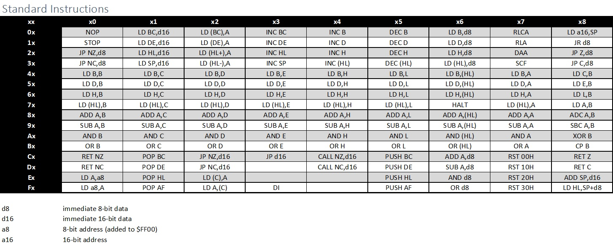
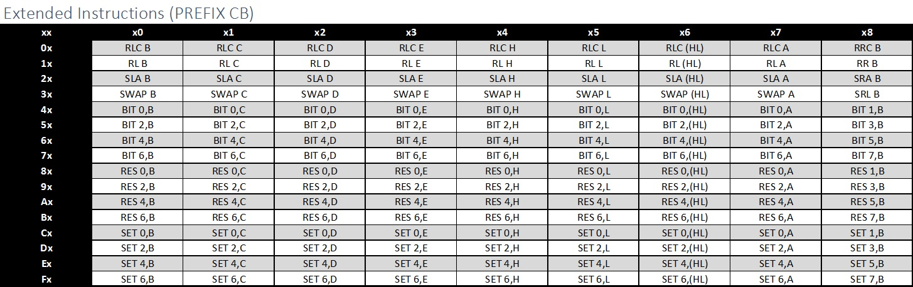
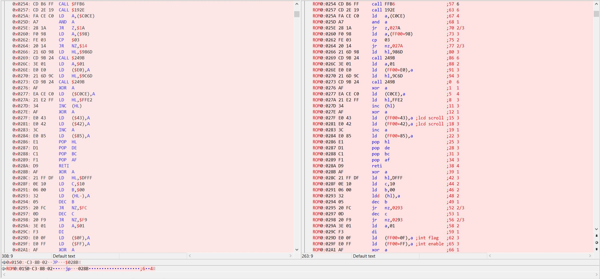

[Back to Dev Diaries](../DevDiaries.md)
## 6/03-6/04/2017
[Related Commit](https://github.com/evanbbass/GameBoi/commit/6b0429b410fc939c95096aa4909de31ff38f2c3d)

This update was targeted at getting the rest of the Game Boy's disassembly mapped out. I continued the format I'd been using, adding items to the map as follows:
```c++
// LD n,nn
{ 0x01, "LD BC,$%04X" },
{ 0x11, "LD DE,$%04X" },
{ 0x21, "LD HL,$%04X" },
{ 0x31, "LD SP,$%04X" },
// etc.
```
In this way, the disassembly can be retrieved via the GetDisassembly method:
```c++
string CPU::GetDisassembly(uint8_t opcode, uint16_t operand)
{
	map<uint8_t, char*>::const_iterator it;

	if (opcode == 0xCB)
	{
		it = sOpcodeDisassembly_PrefixCB.find(static_cast<uint8_t>(operand));
		if (it == sOpcodeDisassembly_PrefixCB.end())
		{
			throw exception("Opcode not found!");
		}
	}
	else
	{
		it = sOpcodeDisassembly.find(opcode);
		if (it == sOpcodeDisassembly.end())
		{
			throw exception("Opcode not found!");
		}
	}

	char str[20];
	sprintf_s(str, sizeof(str), it->second, operand);
	return str;
}
```
This method existed in the previous commit, but was updated based on new information I realized after going through the Game Boy documentation some more. There is a secondary opcode table that I didn't initially realize was necessary: there are "Prefix-CB" instructions that are actually two bytes long and begin with a hex 0xCB. This roughly doubled the number of instructions I had to add, although the extra instructions were, for this part at least, mostly copy-pastes of each other, so there wasn't much added complexity.

In order to support these changes, I added some additional debug code to Program.cpp. First, I refactored the code I had before (printing out all possible opcodes and their disassembly) into a separate method, PrintOpcodes() to clean up main, and also to preserve this code for posterity since I didn't really need it any more. Then I added a new method to print a [familiar-looking table](http://pastraiser.com/cpu/gameboy/gameboy_opcodes.html) to a file:
```c++
void PrintOpcodeChartToFile(const string& filename)
{
	ofstream csv(filename);

	if (csv.good())
	{
		csv << "Standard Instructions" << endl;
		csv << ";x0;x1;x2;x3;x4;x5;x6;x7;x8;x9;xA;xB;xC;xD;xE;xF" << endl;
		for (int i = 0; i <= 0xF; ++i)
		{
			csv << hex << uppercase << i << "x;";

			for (int j = 0; j <= 0xF; ++j)
			{
				uint8_t opcode = static_cast<uint8_t>((i << 4) | j);
				if (opcode == 0xCB)
				{
					csv << "PREFIX CB";
				}
				else
				{
					try
					{
						csv << CPU::GetDisassembly(opcode);
					}
					catch (...)
					{
						
					}
				}

				csv << ";";
			}

			csv << endl;
		}

		csv << endl;
		csv << "Extended Instructions (PREFIX CB)" << endl;
		csv << ";x0;x1;x2;x3;x4;x5;x6;x7;x8;x9;xA;xB;xC;xD;xE;xF" << endl;
		for (int i = 0; i <= 0xF; ++i)
		{
			csv << hex << uppercase << i << "x;";

			for (int j = 0; j <= 0xF; ++j)
			{
				uint8_t operand = static_cast<uint8_t>((i << 4) | j);
				try
				{
					csv << CPU::GetDisassembly(0xCB, operand);
				}
				catch (...)
				{

				}

				csv << ";";
			}

			csv << endl;
		}
	}
}
```
Obviously this won't print a true csv, since the delimiters are semicolons and not commas, but that was a workaround I had to use since the opcodes contained commas within their disassembly.

From that .csv file, I could import the table into Excel, work some formatting magic, and get a table looking very similar to the above link. That way I could more easily verify that my disassembly was correct.





## 6/05/2017
[Related Commit](https://github.com/evanbbass/GameBoi/commit/1613aef9fa821f615d31d61339d78a2a8ba53a62)

This update was to begin the process of fully disassembling a ROM file. When I began writing the code to disasseble the ROM, I very soon realized a shortcoming of my existing map solution: Even if I wasn't going to be doing anything with the instruction, I still needed to know how long the operand is to be able to read and print the value correctly. As such, I had to perform the rather annoying task of changing the value type of the map and modifying every line in the map by hand (the alternative would be to simply make a new map for each attribute, but that would be significantly more annoying and far less readable).

First I made a new very simple Instruction struct:
```c++
struct Instruction
{
	const char* Disassebly;
	int32_t OperandLength;
	int32_t Cycles;
};
```
In the future this will likely also require a function pointer, but I can't really set that up until I have functions to point to, and the design for that hasn't been fully fleshed-out yet.

I then modified the map as such:
```c++
// Before
{ 0x06, "LD B,$%02X" },
{ 0x0E, "LD C,$%02X" },
{ 0x16, "LD D,$%02X" },
{ 0x1E, "LD E,$%02X" },
{ 0x26, "LD H,$%02X" },
{ 0x2E, "LD L,$%02X" },

// After
{ 0x06, { "LD B,$%02X", 1, 8 } },
{ 0x0E, { "LD C,$%02X", 1, 8 } },
{ 0x16, { "LD D,$%02X", 1, 8 } },
{ 0x1E, { "LD E,$%02X", 1, 8 } },
{ 0x26, { "LD H,$%02X", 1, 8 } },
{ 0x2E, { "LD L,$%02X", 1, 8 } },
```
I also added a function similar to GetDisassembly called GetOperandLength:
```c++
int32_t CPU::GetOperandLength(uint8_t opcode)
{
	if (opcode == 0xCB)
	{
		return 1;
	}

	map<uint8_t, Instruction>::const_iterator it = sOpcodeDisassembly.find(opcode);
	if (it == sOpcodeDisassembly.end())
	{
		throw exception("Opcode not found!");
	}

	return it->second.OperandLength;
}
```

The last minor change was to remove the index operators from the Cartridge class in favor of Read/Write Byte/Word methods.

## 6/06/2017
[Related Commit 1](https://github.com/evanbbass/GameBoi/commit/0208553e34197550b7a66476814b94674449eeeb)
[Related Commit 2](https://github.com/evanbbass/GameBoi/commit/e1e3f5387c1bfd0b0e806a88312cf77da4505ce4)
[Related Commit 3](https://github.com/evanbbass/GameBoi/commit/df59aa3527164c242ef9d00b53009a064f287457)
[Related Commit 4](https://github.com/evanbbass/GameBoi/commit/885aad59665ea5f0a57d69134fc3c98d90e42ff3)

The first thing I did today was adjust the formatting to be able to compare to NO$GMB's debug output using [Beyond Compare](https://www.scootersoftware.com) (which is a great tool). While there were several minor formatting differences (it used LDI (HL),A whereas I used LD (HL+),A, I put a '$' before hex digits while it didn't, etc.), there were also a few major differences that helped me notice errors in some of my disassembly. Among the errors were: an incorrect argument length for the POP instruction; a few JR instructions mislabeled as JP; and LD A,(n) and LD (n),A having their opcodes mixed up.

In the end this was a very helpful exercise. While the disassembly itself isn't necessarily vital to the emulator's success, the argument length error would have definitely caused problems later on.



Now that I was confident with the disassembly output, I began implementing some of the opcodes. I added a function pointer to the Instruction class:

```c++
struct Instruction
{
	typedef void (CPU::*InstructionFunction)(uint16_t);

	Instruction(const char* disassembly, int32_t operandLength, int32_t cycles, InstructionFunction function) :
        	Function(function), Disassebly(disassembly), OperandLength(operandLength), Cycles(cycles)
	{
	}

	InstructionFunction Function;
	const char* Disassebly; // String disassebly
	int32_t OperandLength; // Length of the operand of the instructions
	int32_t Cycles; // Number of CPU clock cycles the instruction takes
	};
```
You'll notice that all of the functions take in a 16-bit operand. This is for uniformity; instructions with no operand will simply ignore it while instructions with one byte operands will convert it to 8-bits.

I had to add a constructor to minimize the impact to the map in the CPU class, since the function pointer had to be first due to packing concerns. This allows me to define the function last (so I can just stick it on the end of the line with minimal modifications) while still having the pointer first within the struct.

In the end I got the 8-bit loads done, which were pretty straightforward. Initially I was hoping to be able to pool some of the instructions into a single method, but that would have complicated the function pointer. Overall, everything is proceeding on schedule.
