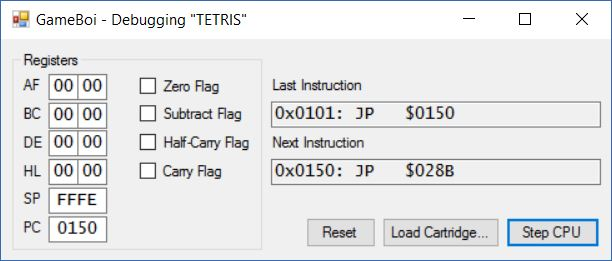

[Back to Home](../../README.md)

[Back to Week 3](Week3.md)

[Next to Week 4](Week4.md)

## 6/20/2017

Finally I have something interesting to post! Work has begun on my debugger, which I'll be using to verify the execution of the ROMs.

This proved to be somewhat tricky. What I was imagining was a Windows Forms application that would visualize the different registers and instructions, similar to NO$GMB. However, since my library has so far been written in an unmanaged native C++11 static library, and Windows Forms run on the .NET framework, I had some interopability problems to work out.

I spent a long time trying various things. My first attempt was to switch my static library to use the Common Language Runtime (CLR). There were several problems with this method, however. The biggest one was that CLR libraries can't be static. Switching to a dynamic library would have involved marking everything in the library with `__declspec(dllexport)`, and even then there were numerous problems.

My next attempt was to make the Windows Forms application a (managed) C++ project and include the unmanaged static library directly. This seemed to work at first, as it built successfully, but as soon as I tried to run the application, it would immediately throw an exception. After some research I thought this might be because of unmanaged static memory being initialized before `main`, but I found no reasonable solutions to this.

After significantly more research and speaking with one of my professors for advice, I landed on what is probably the best solution: wrapping my static library in a C++/CLI dynamic library. What this does is wrap all of the unmanaged classes in a managed class, which can then be used by other managed programs.

Here is an example of what I ended up doing:

```c++
#include "Cartridge.h"

namespace GameBoiManaged
{
	public ref class CartridgeManaged
	{
	public:
		CartridgeManaged();
		explicit CartridgeManaged(System::String^ filename);
		CartridgeManaged(GameBoi::Cartridge& unmanagedCartridge);

		property GameBoi::Cartridge& Unmanaged { GameBoi::Cartridge& get(); }

		void ReadFromFile(System::String^ filename);
		void Reset();

		System::Byte ReadByte(System::UInt16 address);
		System::UInt16  ReadWord(System::UInt16  address);
		void WriteByte(System::UInt16  address, System::Byte value);
		void WriteWord(System::UInt16  address, System::UInt16  value);

		void SetSwitchableBankIndex(System::UInt32 index);

		property System::String^ GameTitle { System::String^ get(); }
		property GameBoi::Cartridge::CartridgeType CartrideType { GameBoi::Cartridge::CartridgeType get(); }
		property bool ColorSupport { bool get(); }
		property bool SuperSupport { bool get(); }

		System::String^ DisassembleRom(System::UInt16 startAddress, System::UInt16 length);
		void DisassebleRomToFile(System::String^ filename, System::UInt16 startAddress, System::UInt16 length);

	private:
		GameBoi::Cartridge* mCartridge;
	};
}
```

The managed class has an unmanaged pointer to the unmanaged version of the class. This pointer is `new`'d in the constructor and `delete`d in the destructor. The managed class then wraps each public method of the unmanaged class. These are all one-liners that just call the same method of the unmanaged class.

I also added a constructor that takes in a reference to an instance of the unmanaged class in case it already exists, and a property to allow accessing the unmanaged class directly if necessary.

This task proved tedious, but it was much more interesting than implementing the opcodes. I learned a lot about C++/CLI (which, as my professor says, is basically an entirely different language than C++). I wouldn't use it on its own (I'd rather use C# if I'm making a .NET application), but it's ability to wrap unmanaged code is very helpful.

----

And now for the fun part: actually making the debugger!

As I said, initially this was a managed C++ project, but once I got the C++/CLI wrapper done, I decided to switch to C#, as I'm much more comfortable making forms applications in it. My very first pass was just getting text boxes up for each register. The registers are labeled as their 16-bit pairs, but each 8-bit register is its own textbox. I also added checkboxes for the flags. (I won't show the code for this as its all boilerplate C# Windows Forms code.)

Once I got that integrated with the new `GameBoyManaged` class, I added a button to advance the CPU. That way I could begin stepping through the code.

```C#
private void buttonStepCPU_Click(object sender, EventArgs e)
{
	mGameBoy.CPU.StepCPU();
	UpdateFields();
}

private void UpdateFields()
{
	RegistersManaged registers = mGameBoy.CPU.Registers;
	textBoxRegA.Text = registers.A.ToString("X2");
	textBoxRegF.Text = registers.F.ToString("X2");
	textBoxRegB.Text = registers.B.ToString("X2");
	textBoxRegC.Text = registers.C.ToString("X2");
	textBoxRegD.Text = registers.D.ToString("X2");
	textBoxRegE.Text = registers.E.ToString("X2");
	textBoxRegH.Text = registers.H.ToString("X2");
	textBoxRegL.Text = registers.L.ToString("X2");
	textBoxRegSP.Text = registers.SP.ToString("X4");
	textBoxRegPC.Text = registers.PC.ToString("X4");
	checkBoxZeroFlag.Checked = registers.ZeroFlag;
	checkBoxSubtractFlag.Checked = registers.SubtractFlag;
	checkBoxHalfCarryFlag.Checked = registers.HalfCarryFlag;
	checkBoxCarryFlag.Checked = registers.CarryFlag;

    textBoxLastInstruction.Text = mLastInstruction;
	textBoxNextInstruction.Text = mNextInstruction;
}
```

Obviously this is all useless without an actual ROM loaded. But now, I don't have to hardcode strings anymore! I can use Windows Forms to allow selecting the file from an [OpenFileDialog](https://msdn.microsoft.com/en-us/library/system.windows.forms.openfiledialog(v=vs.110).aspx).

```C#
private void buttonLoadCartridge_Click(object sender, EventArgs e)
{
	OpenFileDialog ofd = new OpenFileDialog
	{
		Title = "Load Game Boy Cartridge",
		Filter = "Game Boy ROMs (*.gb, *.gbc)|*.gb;*.gbc|All files (*.*)|*.*",
		Multiselect = false
	};

	if (ofd.ShowDialog() == DialogResult.OK)
	{
		mGameBoy.LoadCartridge(ofd.FileName);
		Reset();
		Text = $"GameBoi - Debugging \"{mGameBoy.MemoryMap.Cartridge.GameTitle}\""; // this sets the title of the main window
	}
}
```

Now we're getting somewhere! The last step is to show the disassembly. I also added a reset button for good measure.

And now, the final product:



## 6/21/2017

Today was dedicated to interrupts. I didn't get to implementation this week, but I have a good idea of how to go about it moving forward.

First I dug through the [documentation](http://marc.rawer.de/Gameboy/Docs/GBCPUman.pdf) I already had, which was helpful in a general sense, but didn't get into the level of detail I needed. After reading through that and some sample source code from other emulators, I still didn't quite understand what triggered them and what was needed of me as the emulator writer.

Eventually I found (through links in [Cinoop](https://cturt.github.io/cinoop.html)'s source code) a [website](http://www.codeslinger.co.uk/pages/projects/gameboy.html) that details how the interupts actually work in detail. This site also had detailed descriptions of other systems I haven't implemented yet, so it will serve as a great source moving forward.