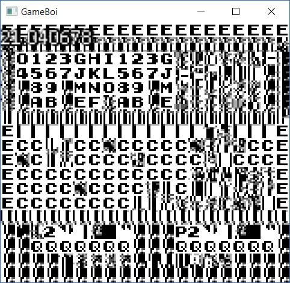
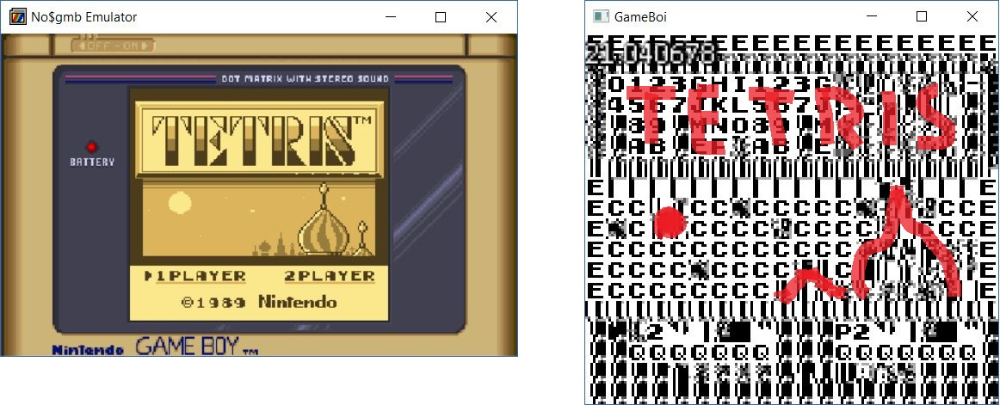
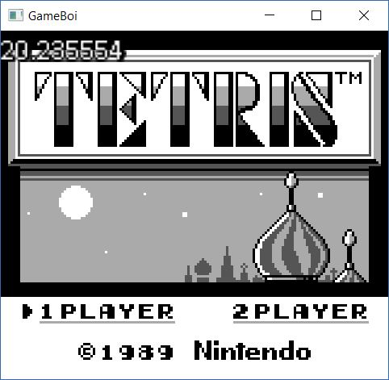

[Back to Home](../../README.md)

[Back to Week 7](Week7.md)

## 7/19/2017
This week was a whole lot of debugging and investigation, along with a great deal of self-loathing as I found all of the stupid mistakes I made along the way.

### Initial Debugging
Last week left off with a "functioning" emulator that was never calling the render functions. My hunch was that it was because interrupts were never being enabled, which prevented the V-Blank interrupt from copying data to video memory.

My professor suggested that I check if interrupts were supposed to be enabled by default, so I tried doing that. After stepping through the code in [NO$GMB](http://problemkaputt.de/gmb.htm), though, I realized Tetris was disabling interrupts before any fired anyway, so that was moot.

After some further digging, I noticed my first major bug (although I don't think it was related): when reading from IO, the memory map was still subtracting out the IO's start address, which is not how that functionality works anymore. The result was that any reads from IO would return 0 instead. On a slightly related note, I forgot to hook up the pallets to the IO class's `WriteByte()` function, so they were never being updated. None of these changes fixed the errors, though.

### Debugging Slowdown
It was around this time that the emulator seemed to run at a snail's pace, despite no real changes to the code (for reference it dropped from ~30-60 FPS in debug mode with diagnostic tools on to about 0.3 FPS in release mode with diagnostic tools off). This threw me off for a while, and caused much frustration. I tried reverting the project to Visual Studio 2015, thinking maybe 2017 had finally bitten the dust, and it seemed to work at first. However, I soon realized that the problem was in fact Visual Studio's conditional breakpoints.

I'm not sure what the conditional breakpoints were doing that caused such a slowdown. But I was able to manually put an `if` statement in the code with a normal breakpoint with no noticable slowdown.

```c++
if (pc == 0x27E9)
{
	volatile int x = 0;
	x;
}

// execute instruction
invoke(instruction.Function, this, operand);
```

The volatile keyword prevents the code from being optimized out, ensuring that the breakpoint will always have a place to break.

This is kind of a gross workaround, but it's necessary for now.

### Discovery
Now that I had a working breakpoint that wasn't killing the emulator, I was able to dig down some more. I discovered that the code was getting stuck in what seemed to be an infinite loop.

The loop was in a function as follows:
```asm
;from NO$GMB's debugger:
ROM0:031F CD E9 27		call 27E9
;;;
ROM0:27E9 21 FF 9B		ld hl,9BFF
ROM0:27EC 01 00 04		ld bc,0400
ROM0:27EF 3E 2F   		ld a,2F
ROM0:27F1 32      		ldd (hl),a
ROM0:27F2 0B      		dec bc
ROM0:27F3 78      		ld a,b
ROM0:27F4 B1      		or c
ROM0:27F5 20 F8   		jr nz,27EF
ROM0:27F7 C9      		ret
```

After breaking when the program counter was at 0x27F7, I found that it was in fact eventually returning, but to address 0x2F2F instead of 0x0322 like it should. This meant the loop was overflowing and overwriting the stack with 0x2F (if you check the instructions you can see it's writing 0x2F to what should be only 0x0400 addresses).

I checked all of the instructions in this function and found ~~I'm an idiot~~ the 16-bit decrement instructions (`dec bc` here) were actually... incrementing. After fixing this, it finally got through the function and started actually rendering!



Well... it's rendering... something.

(If you look closely, you can kind of see the Tetris main screen)


So obviously it's trying to do the right thing, just reading the wrong memory.

I also discovered another problem that's less apparent from a screenshot: input seems to be off. There is an arrow being drawn showing the selection on the main screen, and it is jumping rapidly between the two options, indicating it thinks the arrow keys are all pressed.

### Correction
Now I had two major problems that I had a decent idea how to fix. So I set about fixing them. As a temporary fix for the graphics, I directly copied GPU code from another source, and, lo and behold, it worked:



After digging through the differences with my original code, I believe it was because my `TileIdentifiersAreUnsigned()` check was backwards. Anyway, now that that was functioning, I moved on to input.

I discovered some bit checks that were incorrect, namely the Button Mode Select bit and the Direction Mode Select bit were backwards, and the Start and Select bits were backwards. Oddly changing those didn't have an immediate effect, and flipping some checks around didn't seem to do anything. Like a USB stick, I tried it one way, flipped it, tried it again, flipped it back, and it magically started working.

### Unit Testing
After discovering that my 16-bit decrements were incorrect, I realized I really needed to test the CPU instructions, so I spent the next few hours writing up tests (for the exact process for that, see my earlier dev diaries). One thing to note here is that since all of the instructions are private, I had to add the test class as a friend of the CPU class.

```c++
namespace GameBoiLibraryTest
{
	class TestCPUInstructions;
}

namespace GameBoi
{
	class CPU final
	{
		friend class GameBoiLibraryTest::TestCPUInstructions;

		// rest of the CPU class header
	}
}
```
This is really icky, but it's the only clean way to give the test class access to the CPU class's private methods.

----

After testing for a while, I found many breaking errors:
* Typos in LD_SP_HL and LD_HL_SP_n which incorrectly added to the wrong register
* Missing parentheses in the carry arithmetic instructions (ADC and SBC) that made the entire result 0 or 1 instead of just adding 0 or 1 to the result
* Error in INC_aHL that incremented HL instead of the value at the address pointed to by HL

I got through most of the more complicated instructions without any other errors, but given the still-existing problems I'll mention in the next section, I might have to test the rest as well.

### Finally
Now that rendering and input work correctly, I was able to run Tetris. After getting past the main menu, however, I noticed two very apparent bugs:

First, most sprites aren't being drawn at all. The arrow on the main menu is a sprite which is being drawn correctly, and there seems to be other sprites that are fine, but most of the rest simply aren't there, despite me being fairly confident in my `DrawSprites()` implementation.

Second, there is no randomization. It always drops square blocks. I know that Tetris uses the divider for it's randomness, so I placed a breakpoint there, and for some reason it only reads when the divider is 0. I double checked the `StepDivider()` function and it is working correctly (and incrementing the divider), but whenever the divider is read, the value is 0. I'll need to investigate this, but the sprites are a higher priority right now.

----

That's it for this week. I wanted to get the Memory Bank Controller architecture in this week, but other bugs prevented me from getting to it.

This is the final week before the end presentation, so hopefully by the end of this week I will be able to play Pokemon Red.
